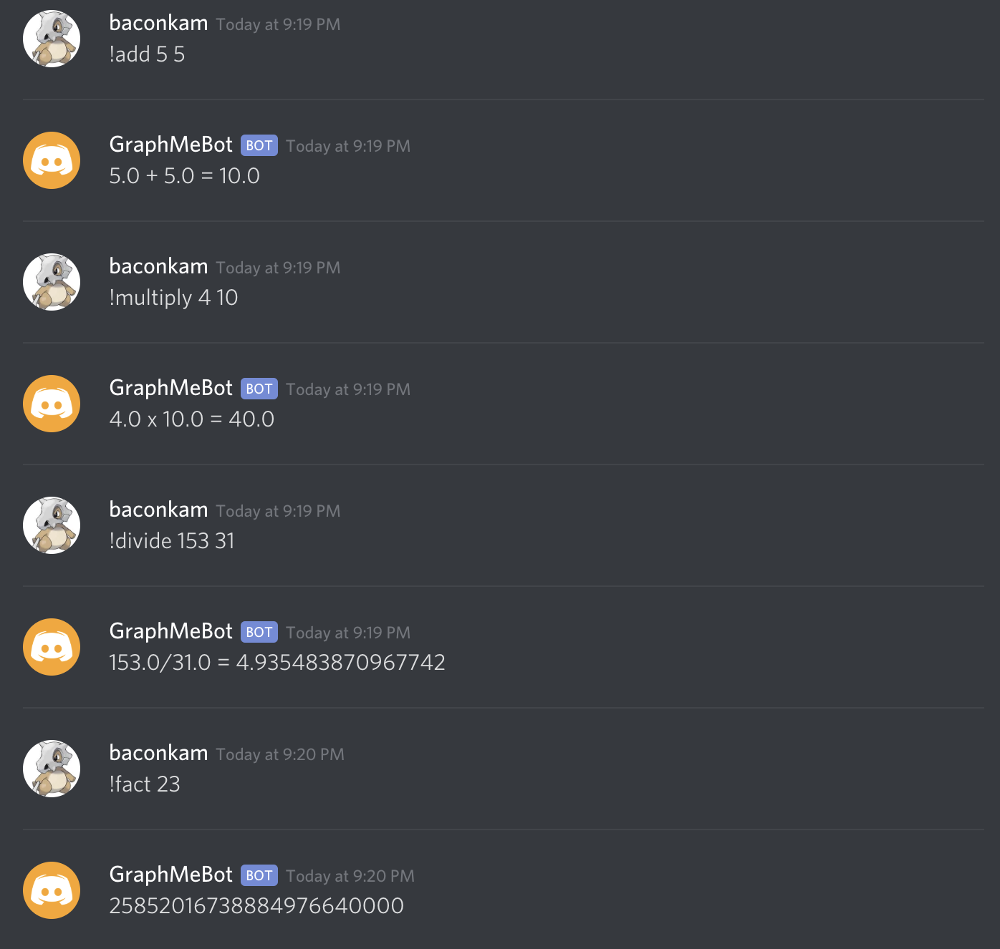
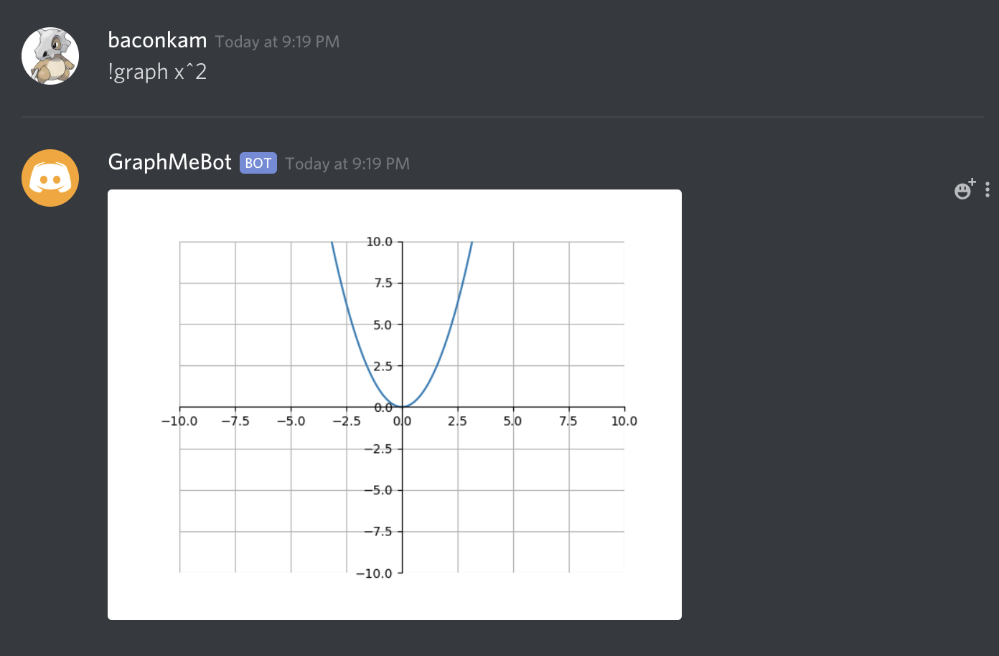
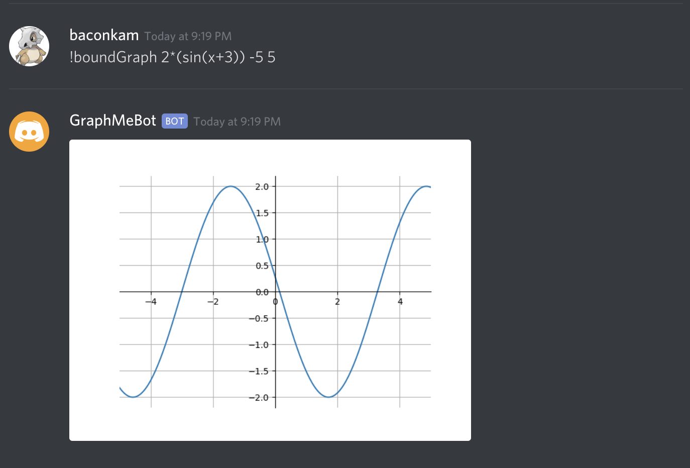
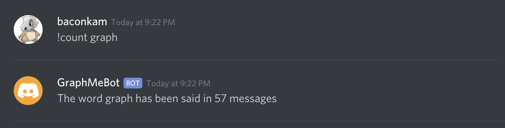

# GraphMeBot
A discord bot that can perform some mathematical functions.

The bot can do simple arithmetic:

Graph functions based on an equation:

Graph functions over a certain region:

Count the number of messages that contain a specified word:

